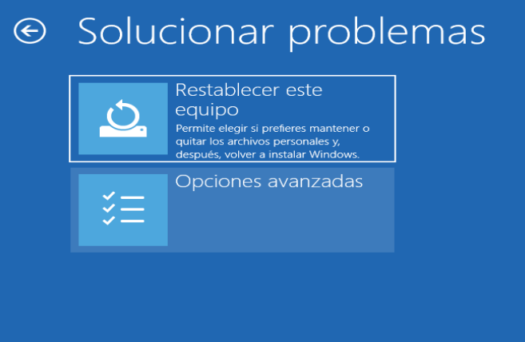

# Tutorial para modificar el orden de arranque desde la BIOS

Hay varias formas de hacer esto:  

1. Reiniciando el ordenador y pulsando la tecla F10(Esto cambia dependiendo del ordenador)
2. Reiniciando Windows mediante Inicio Avanzado para elegir unidad de arranque

---

## Método 1 - Reinicio
Para hacerlo de esta forma, hay que reiniciar el ordenador y fijarse al principio del arranque en la primera pantalla suele decir **Press F10 to setup bios** o algo similar, cómo ya dije depende de cada ordenador.

---

## Método 2 - Desde Windows lanzando Inicio Avanzado
- Lo primero es entrar en configuración

- Entramos en Actualización y seguridad

- Pulsamos en recuperación

- Y en inicio avanzado:
    - Reiniciar ahora

- Al reiniciar Windows en lugar de iniciar normalmente, nos muestra esta pantalla.
    - Elegimos **Solucionar Problemas**

- En esta pantalla elegimos **Opciones Avanzadas**

- Aquí elegimos Configuración de firmware UEFI

- Pulsamos sobre el botón reiniciar

- Esto nos lleva a esta pantalla, que es el menú avanzado de puesta en marcha de Windows.
    - Tener en cuenta que esto puede cambiar dependiendo del ordenador. 
    - Con **F9** Podemos acceder a los dispositivos de arranque
        - Desde aquí podríamos arrancar sobre un USB Booteable, sin necesidad de modificar la BIOS!!
    - Con **F10** entramos en la configuración de la BIOS
    - Con **ENTER** continuamos el inicio de windows normalmente.

- Ya estamos dentro de la BIOS, aquí nos desplazaremos con las flechas, arriba, abajo, izquierda, derecha, por los menús:
    - Lo primero es movernos a System Configuration

- Aquí pulsamos enter sobre **Languaje**
    - Seleccionamos el idioma **Español**
- Luego bajamos con las flechas hasta **Opciones de arranque**
    - Pulsamos intro

- Aquí vemos las opciones de arranque de nuestro ordenador
- Lo primero es permitir el arranque desde USB
    - Bajar hasta Arranque USB
    - Pulsar enter encima y cambiar a Activar, en el caso que no estuviera activado.
- Ahora tenemos que cambiar el **Orden de arranque UEFI**
    - Bajamos con las flechas hasta ahí, hasta que estemos encima de **Administrador de arranque de SO**
    - Ahora con las teclas **F5** y **F6** subimos o bajamos esta línea
    

- Cambiamos el orden de arranque 
- Tenemos que bajarlo de preferencia, hasta que quede detrás de los USB

- Salimos guardando los cambios

Ahora el ordenador reinicia, y si tenemos un USB Booteable conectado, el ordenador arrancará sobre el USB